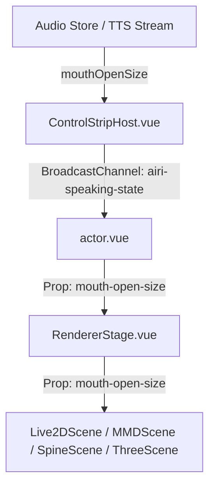

# Rosetta Stone: Speaking & Mouth Synchronization Pipeline

This document maps out the end-to-end data pipeline responsible for capture, broadcast, and rendering of character mouth movement (lip-syncing/speaking) across the AIRI applications.



---

## 1. State Capture (Audio Store)
- **File:** [audio.ts](file:///Users/richardpinedo/Projects.nosync/airi/airi_dasilva333/packages/stage-ui/src/stores/audio.ts)
- **Role:** Tracks TTS audio output and updates the global reactive variable `mouthOpenSize` (range `0.0` to `1.0`) based on live frequency/amplitude analysis during speech.

## 2. Host Window Broadcast
- **File:** [ControlStripHost.vue](file:///Users/richardpinedo/Projects.nosync/airi/airi_dasilva333/packages/stage-ui/src/components/scenes/ControlStripHost.vue)
- **Role:** Watches `mouthOpenSize` and `nowSpeaking` from the speaking store. It broadcasts these values to secondary windows (such as the overlay stage) via the `airi-speaking-state` BroadcastChannel:
  ```typescript
  postSpeakingState({ mouthOpenSize: mouth, nowSpeaking: speaking })
  ```

## 3. Actor Window Broadcast Receiver
- **File:** [actor.vue](file:///Users/richardpinedo/Projects.nosync/airi/airi_dasilva333/apps/stage-tamagotchi/src/renderer/pages/actor.vue)
- **Role:** Subscribes to the `airi-speaking-state` BroadcastChannel and updates local store states when updates arrive, forwarding `mouthOpenSize` as a prop to `<RendererStage>`.

## 4. Stage Router / Propagator
- **File:** [RendererStage.vue](file:///Users/richardpinedo/Projects.nosync/airi/airi_dasilva333/packages/stage-ui/src/components/scenes/RendererStage.vue)
- **Role:** Distributes the `mouthOpenSize` value down to the specific renderer components depending on whether the loaded model is Live2D, VRM (Three), Spine, or MMD.

## 5. Renderers

### A. Spine Scene Renderer
- **File:** [Model.vue](file:///Users/richardpinedo/Projects.nosync/airi/airi_dasilva333/packages/stage-ui-spine/src/components/scenes/spine/Model.vue)
- **Role:** Modifies local bones during the animation update loop:
  ```typescript
  const mouthBone = skeleton.findBone('mouth') || skeleton.findBone('jaw') || skeleton.findBone('mouth_open')
  if (mouthBone) {
    mouthBone.y = mouthBone.data.y - (props.mouthOpenSize * 15)
  }
  ```

### B. MMD Scene Renderer
- **File:** [Model.vue](file:///Users/richardpinedo/Projects.nosync/airi/airi_dasilva333/packages/stage-ui-mmd/src/components/scenes/mmd/Model.vue)
- **Role:** Locates MMD morph indices corresponding to "mouth open", "a", or similar morph keys, and sets their weights dynamically to match `mouthOpenSize`.

### C. VRM (Three.js) Renderer
- **File:** [lip-sync.ts](file:///Users/richardpinedo/Projects.nosync/airi/airi_dasilva333/packages/stage-ui-three/src/composables/vrm/lip-sync.ts)
- **Role:** Blends VRM mouth shapes (A, E, I, O, U) using weighted influences based on audio frequencies.
