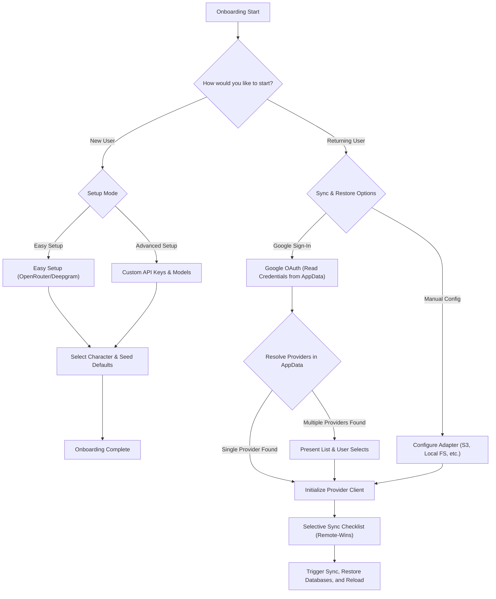

# Design Document: Bring Your Own Storage (BYOS) Cloud Sync

**Status:** Confirmed / Implemented

**Goal:** Empower users with privacy-preserving, local-first multi-device database and asset synchronization using standard cloud providers (S3/R2 and Local File System targets) without central server custodians.

---

## 🏛️ Architecture & Philosophy

The BYOS (Bring Your Own Storage) sync engine adheres to strict local-first autonomy:
1. **Serverless Custody:** No proprietary AIRI hosted databases or sync servers. The user owns their cloud storage backend.
2. **Entity-Level Sync:** Rather than syncing a single massive database file (which is prone to write conflict corruption), the sync engine manages individual modular JSON files for each Session, Character Card, and Memory entry.
3. **Optimized Large Asset Sync:** Heavy assets (VRMs, Live2D packages, Spine folders, audio cache, custom backgrounds) are synced selectively and folder-by-folder to the bucket, allowing Mac, Windows, and Web clients to share model and asset libraries without duplicate downloads.

---

## 🛠️ Unified Interceptor Layer: The Outbox Sync Tracker

Rather than modifying individual IndexedDB Dexie schemas or hooking into every database repository pipeline, synchronization tracking is handled transparently at the core storage engine wrapper:

### Global Storage Interceptors
The storage manager ([storage.ts](file:///C:/Users/h4rdc/Documents/Github/airi-rebase-scratch/packages/stage-ui/src/database/storage.ts)) mounts two `unstorage` namespaces:
* `local`: Points to the IndexedDB base `airi-local`.
* `outbox`: Points to the IndexedDB base `airi-sync-queue`.

We monkey-patch `storage.setItem`, `storage.setItemRaw`, and `storage.removeItem` to track mutations:
```typescript
async function enqueueSync(key: string, action: 'upsert' | 'delete') {
  if (storageState.isImportingRemoteData)
    return
  if (!key.startsWith('local:'))
    return
  if (key.startsWith('local:sync-metadata'))
    return // Skip sync tracker metadata

  const keyWithoutPrefix = key.replace('local:', '')
  const now = Date.now()

  // 1. Update local modification timestamp
  if (action === 'upsert') {
    await storage.setItemRaw(`local:sync-metadata/timestamps/${keyWithoutPrefix}`, now)
  }
  else {
    await storage.removeItem(`local:sync-metadata/timestamps/${keyWithoutPrefix}`)
  }

  // 2. Queue operation in the outbox
  await storage.setItemRaw(`outbox:queue/${keyWithoutPrefix}`, {
    key,
    action,
    timestamp: now
  })
}
```

* **Import Bypass:** During sync downloads, `storageState.isImportingRemoteData` is set to `true` to disable outbox enqueuing and prevent infinite sync feedback loops.

---

## 🖥️ UI Integration Flow

The Cloud Sync feature leverages existing **Providers** and **Modules** patterns for integration:

### 1. Settings > Providers
A new tab category **"Cloud"** is added to the Providers view:
* **S3-Compatible Storage Card:** Connects Cloudflare R2, AWS S3, Backblaze B2, or self-hosted MinIO. Inputs: Access Key ID, Secret Access Key, Endpoint URL, Bucket Name, Region.
* **Local File System Card (Desktop only):** Connects a NAS or local directory path.

### 2. Settings > Modules > Cloud Sync
* **Toggle State:** Activates background sync intervals.
* **Settings Panel:** Contains the provider selector, active sync status, a manual **[Sync Now]** trigger, and a list of unresolved conflicts.

---

## 🔄 Reconcile & Merge Strategy

When merging data from two active instances (e.g. Desktop and Web):

### 1. Unified `StorageClient` Interface
Both Local FS and S3 sync run on top of a unified interface:
```typescript
export interface StorageClient {
  validate: () => Promise<{ success: boolean, error?: string }>
  listFiles: () => Promise<{ success: boolean, files?: Array<{ relPath: string, mtime: number, size: number }>, error?: string }>
  readFile: (relPath: string, encoding?: 'utf-8' | 'base64') => Promise<{ success: boolean, content?: string, error?: string }>
  writeFile: (relPath: string, content: string, encoding?: 'utf-8' | 'base64', append?: boolean) => Promise<{ success: boolean, mtime?: number, error?: string }>
  deleteFile: (relPath: string) => Promise<{ success: boolean, error?: string }>
}
```

### 2. S3 Implementation Realities
* **mtime Translation:** Since S3 objects do not support custom file modification time writes, we map the S3 `LastModified` timestamp returned by `ListObjectsV2` as the remote `mtime`.
* **XML Decoding:** To run natively in the browser without Node dependencies, `S3StorageClient` uses the browser-native `DOMParser` to extract key, size, and timestamp values from S3 XML responses.
* **Large File Optimizations:** Instead of converting heavy files to Base64 (which causes CPU and memory bottlenecks), binary data is uploaded as raw `Blob` or `ArrayBuffer` payloads using signed HTTP PUT requests.

### 3. Smart Merges vs Overwrites
* **Standard Keys:** Use Last-Write-Wins (LWW) comparison between the remote `mtime` and the local timestamp.
* **Mergeable Keys:** For cumulative tables like `airi-cards`, `short-term-memory`, `text-journal`, and `echo-chips`, the sync engine downloads the remote JSON, reads the local state, merges the items by ID (using LWW per item), and writes the merged result back to both remote and local databases.

### 4. Safety Heuristics Guard
To prevent accidental deletions or data loss, we run a safety check before applying changes:
* **Contraction Check:** If a sync operation would replace a larger dataset (>10KB) with a much smaller one (<2KB or >5x size reduction), it is blocked.
* **Conflict State:** The engine halts auto-overwrite for that key and registers a sync conflict under `local:sync-metadata/conflicts/<key>`.
* **Resolution Options:** The user can manually resolve the conflict from the UI choosing **Keep Local**, **Keep Remote**, or **Merge**.

---

## 🗃️ Data Inventory & Integration Points

| Category / UI Name | Database / Storage Key | Sync Behavior |
| :--- | :--- | :--- |
| **Chat Sessions** | `local:chat/sessions/*` | Individual JSON files. Standard LWW. |
| **Character Cards** | `local:airi-cards` | JSON representation. Merged key-value map by character ID. |
| **Memory Segments** | `local:memory/short-term/local`, `local:memory/text-journal/local`, `local:memory/echo-chips/local` | JSON arrays. Merged by item ID using LWW. |
| **Director Notes** | `local:director/sessions/*` | Standard LWW. |
| **Providers Config** | `local:providers/*` | Standard LWW. Excludes the current sync configuration settings to prevent loopbacks. |
| **Background Images** | `localforage` (`bg-*`) | Reconciled via metadata JSON + raw PNG images under `assets/backgrounds/`. Deletions tracked via `local:sync-metadata/deleted-backgrounds/*`. |
| **Display Models** | `localforage` (`display-model-*`) | Binary GLB/Zip uploaded under `assets/models/{id}.bin`, with previews and textures saved as sidecar files. Manifested globally via `assets/models/manifest.json`. Deletions tracked via `local:sync-metadata/deleted-models/*`. |

---

## 🎯 Onboarding Integration & Selective Sync Flow

To improve onboarding conversion and protect user data, the startup experience is split into two distinct paths: starting fresh and restoring from a previous backup.

### 1. The Redesigned Onboarding Flow Chart
Upon launching the application for the first time, the user is presented with a choice:
* **`How would you like to start?`**
  * **`[ New User ]`**: Direct setup from scratch.
    * Leads to **`[ Easy Mode ]`** (auto-configured defaults) or **`[ Advanced Mode ]`** (manually configuring API keys/models).
  * **`[ Returning User ]`**: Restore an existing cloud backup.
    * Leads to **`[ Google Sign-In ]`** (Flow 1) or **`[ Manual Config ]`** (Flow 2).



---

### 2. Returning User Flow 1: Google OAuth Credential Resolution
When a returning user selects **`[ Google Sign-In ]`**:
1. The app requests access exclusively to the secure Google Drive AppData sandbox (`https://www.googleapis.com/auth/drive.appdata`).
2. The sync engine checks the AppData folder for a credentials configuration file (`cloud-providers-manifest.json`).
3. It parses this file to extract any saved sync provider credentials (e.g. S3, Dropbox, etc.).
   * **Single Provider Found**: The engine automatically initializes the matched `StorageClient` client.
   * **Multiple Providers Found**: The UI displays a selection card list showing all saved cloud provider configs (e.g. "Cloudflare R2 S3 Backend", "Dropbox Sync"), and the user selects the target provider.
   * **No Provider Configurations Found**: The UI notifies the user and redirects them to the Manual Config flow.
4. The user lands on the **Selective Sync Scope** checklist to choose what to sync, downloads the assets under the `remote-wins` strategy, and triggers a page refresh to apply the database.

---

### 3. Returning User Flow 2: Manual Config
When a returning user selects **`[ Manual Config ]`**:
1. The user picks their target sync adapter (S3, Local File System, etc.) and fills in the configuration inputs (Access Key ID, endpoints, directories, etc.).
2. The engine validates the connection.
3. At the end of configuration, the app prompts: *"Would you like to securely link your Google account to back up these cloud settings?"*
   * If **Yes**: Signs in via Google OAuth and uploads the S3/adapter config to their Google Drive AppData folder for easy single-click restoring on future devices.
4. The user proceeds to the **Selective Sync Scope** checklist (LWW or `remote-wins`), downloads selected assets, and reloads the window.

---

### 4. Selective Sync Checklist Layout
The sync selection screen uses a hierarchical installer-style tree representation of the remote backup data:
* **Root Nodes (Store Names):**
  * `[x] Database Core & Settings` (Always checked & required)
  * `[ ] Chat Sessions` (Lists character names dynamically)
  * `[ ] Custom Background Images` (Lists character image bundles sorted by size/count descending)
  * `[ ] Display Models` (Lists flat user-uploaded VRM / Live2D / Spine / MMD files with real sizes)
* **Concept Mapping search helper**: User can type a character name and click **Select All Related** to inspect the character card's `visual_assets` and auto-check all referenced backgrounds and display models.

---

## 🔒 The Zero-Custody Solution: Credential Delegation via Google AppData Sandbox

Creating our own centralized database (even just for storing encrypted S3 credentials) opens up backdoor accusations and introduces server-maintenance overhead. We need a system that offers the setup convenience of a single username/password login without our software ever holding custody of the keys.

### 3. The Google Drive OAuth AppData Sandbox Flow
Instead of hosting a credential database, we delegate authentication and credentials management to **Google Drive's `appDataFolder` sandbox scope**:

* **Minimal Scope Request:** During onboarding, the user is offered a "Restore from Cloud (Google Sign-In)" path. The app requests authorization exclusively for the `https://www.googleapis.com/auth/drive.appdata` OAuth scope.
* **Sandbox Isolation:** This folder is hidden from the standard Google Drive UI. Users cannot accidentally delete it, and other third-party apps cannot inspect it. Only our open-source client (running locally in their browser/desktop) has access.
* **The Bootstrap File (`airi_bootstrap.json`):**
  - **First Time Config:** The user logs in via Google, inputs their S3/Dropbox credentials in the client, and the client uploads them directly to `appDataFolder/airi_bootstrap.json`.
  - **Second Device Link:** The user signs in with Google. The client downloads `airi_bootstrap.json` from their Google Drive AppData sandbox, decrypts it locally, and initializes the high-speed S3/R2 sync engine instantly.
* **Serverless Autonomy:** No intermediate server of ours is involved in the handshake or key storage. The code is entirely client-side, making it audited, verifiable, and free of custody liability.

### 4. Adapter Ecosystem Expansion (Roadmap)
While S3 remains our high-performance asset engine, the credentials workflow should adapt to support a broader storage matrix:
* **Storage Adapters:** The system should allow the user to select S3/R2, Dropbox, or Google Drive itself as their physical database storage engine.
* **Independent Tokens:** If Google Drive itself is selected as the main storage engine, the AppData folder is used to hold credentials for other sub-services, or standard storage directories are mapped.
* **Modular Refresh Handshake:** The client will independently manage token lifecycles (such as OAuth refresh tokens for Dropbox/Google Drive) behind the scenes without interrupting the user's local interaction.


